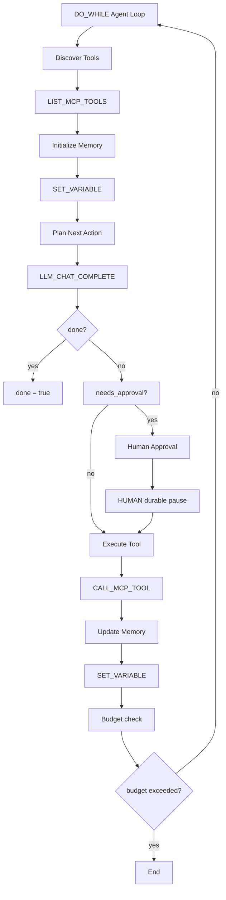

# GitHub AI Agent Architecture Patterns

> **Category**: AI Agent Production Patterns
> **Source**: Multiple GitHub Repositories
> **Verified**: true
> **Last Updated**: 2026-05-10
> **Status**: Comprehensive Pattern Collection

---

## 🎯 Overview

Collection of production-ready AI agent architecture patterns from leading GitHub repositories including Conductor, Microsoft, AI Agent Book, and 12-Factor Agents.

---

## 🏗️ Conductor Production Agent Pattern

### Source: [conductor-oss/conductor](https://github.com/conductor-oss/conductor) (31.8k stars)

### Canonical Agent Architecture


### Agent Concerns Mapping
| Agent Concern | Conductor Primitive | Implementation |
|----------------|-------------------|----------------|
| **Plan next action** | `LLM_CHAT_COMPLETE` | LLM receives goal + context + tool list |
| **Select tool at runtime** | `DYNAMIC` task | LLM output determines next task type |
| **Execute tool** | `CALL_MCP_TOOL`, `HTTP`, `SIMPLE` | Tool runs with retry policy and I/O recording |
| **Retry with backoff** | Task definition `retryLogic` | `FIXED`, `EXPONENTIAL_BACKOFF`, `LINEAR_BACKOFF` |
| **Parallel tool calls** | `FORK/JOIN` or `DYNAMIC_FORK` | Fan out to N tools in parallel |
| **Memory/context handoff** | `SET_VARIABLE` + workflow variables | Accumulate results across iterations |
| **Human approval gate** | `HUMAN` task | Durable pause survives restarts |
| **Long wait (hours/days)** | `WAIT` task | Timer-based durable pause |
| **Resume from external event** | `HUMAN` task + webhook/API | External system calls Task Update API |
| **Reflection/evaluation loop** | `DO_WHILE` with LLM-as-judge | Second LLM evaluates output quality |
| **Budget/iteration cap** | `DO_WHILE` `loopCondition` | `iteration < maxIterations` or token/cost limits |

### Key Implementation Pattern
```typescript
// Conductor-style agent loop
class ProductionAgent {
  async execute(goal: string, tools: Tool[], budget: Budget) {
    let memory = new Memory();
    let iteration = 0;
    
    while (iteration < budget.maxIterations && budget.tokensUsed < budget.maxTokens) {
      // Plan next action
      const plan = await this.llm.complete({
        prompt: `Goal: ${goal}\nContext: ${memory.toString()}\nTools: ${tools.map(t => t.name)}`,
        responseFormat: 'structured'
      });
      
      if (plan.action === 'done') break;
      
      // Check for human approval
      if (plan.requiresApproval) {
        await this.humanApproval(plan);
      }
      
      // Execute tool
      const result = await this.executeTool(plan.tool, plan.parameters);
      
      // Update memory
      memory.add(plan.action, result);
      
      iteration++;
    }
  }
}
```

---

## 🎯 Microsoft Multi-Agent Reference Architecture

### Source: [microsoft/multi-agent-reference-architecture](https://github.com/microsoft/multi-agent-reference-architecture) (197 stars)

### Architecture Components
```typescript
interface MultiAgentSystem {
  // Building Blocks
  agents: AgentRegistry;
  memory: MemorySystem;
  communication: AgentCommunication;
  observability: ObservabilitySystem;
  
  // Design Options
  orchestration: OrchestrationPattern;
  governance: GovernanceFramework;
  security: SecurityModel;
  
  // Reference Architecture
  reference: ReferenceArchitecture;
}

interface Agent {
  id: string;
  type: AgentType;
  capabilities: Capability[];
  memory: AgentMemory;
  communication: CommunicationChannel;
  governance: GovernancePolicy;
}
```

### Key Patterns
1. **Agent Registry**: Centralized agent discovery and management
2. **Memory System**: Shared context across agents
3. **Communication**: Agent-to-agent messaging protocols
4. **Observability**: Comprehensive monitoring and logging
5. **Security**: Authentication, authorization, and audit trails
6. **Governance**: Policy enforcement and compliance

---

## 📚 AI Agent Architecture Book Patterns

### Source: [Kocoro-lab/ai-agent-book](https://github.com/Kocoro-lab/ai-agent-book) (202 stars)

### 9-Part Structure
| Part | Topic | Key Patterns |
|------|-------|--------------|
| **Part 1** | Agent Fundamentals | ReAct Loop, Basic Agent |
| **Part 2** | Tools & Extensions | MCP, Skills, Hooks |
| **Part 3** | Context & Memory | RAG, Vector Storage, Memory Management |
| **Part 4** | Single Agent Patterns | Planning, Reflection, CoT |
| **Part 5** | Multi-Agent Orchestration | DAG, Supervisor, Handoff |
| **Part 6** | Advanced Reasoning | ToT, Debate, Research |
| **Part 7** | Production Architecture | Scaling, Monitoring, Deployment |
| **Part 8** | Enterprise Features | Token Budget, OPA, WASI Sandbox |
| **Part 9** | Frontier Practices | Computer Use, Agentic Coding |

### Shannon Reference Implementation
```typescript
// Three-layer multi-agent system
interface ShannonArchitecture {
  // Layer 1: Orchestration (Go)
  orchestrator: {
    budget: BudgetManager;
    policy: PolicyEngine;
    coordination: CoordinationService;
  };
  
  // Layer 2: Agent Core (Rust)
  agentCore: {
    execution: ExecutionEngine;
    sandbox: SandboxEnvironment;
    rateLimit: RateLimiter;
  };
  
  // Layer 3: LLM Service (Python)
  llmService: {
    inference: InferenceService;
    tools: ToolRegistry;
    vectors: VectorStore;
  };
}
```

---

## 🔧 12-Factor Agents Pattern

### Source: [humanlayer/12-factor-agents](https://github.com/humanlayer/12-factor-agents) (19.7k stars)

### The 12 Factors
1. **Natural Language to Tool Calls**: LLM determines workflow via structured outputs
2. **Own your prompts**: Version control and manage prompts like code
3. **Own your context window**: Strategic context management
4. **Tools are just structured outputs**: Unified tool calling approach
5. **Unify execution state and business state**: Single source of truth
6. **Launch/Pause/Resume with simple APIs**: Durable execution
7. **Contact humans with tool calls**: Human-in-the-loop integration
8. **Own your control flow**: Deterministic execution with AI guidance
9. **Compact errors into context window**: Error handling for LLM consumption
10. **Small, focused agents**: Single responsibility principle
11. **Trigger from anywhere**: Multi-channel integration
12. **Make your agent a stateless reducer**: Functional programming approach

### Core Execution Loop
```typescript
// 12-Factor Agent execution pattern
class TwelveFactorAgent {
  async execute(event: Event): Promise<Result> {
    let context = new ContextWindow(event);
    
    while (!context.isComplete()) {
      // 1. LLM determines next step
      const nextStep = await this.llm.getNextStep(context);
      
      // 2. Execute tool call
      const result = await this.executeTool(nextStep.tool, nextStep.parameters);
      
      // 3. Compact result into context
      context.addStep(nextStep, result);
      
      // 4. Check for human interaction
      if (nextStep.requiresHuman) {
        const humanInput = await this.contactHuman(nextStep.humanRequest);
        context.addHumanInput(humanInput);
      }
    }
    
    return context.getResult();
  }
}
```

---

## 🚀 Claude Code Architecture Patterns

### Source: [VILA-Lab/Dive-into-Claude-Code](https://github.com/VILA-Lab/Dive-into-Claude-Code)

### Key Insights
1. **Operational Harness > Model**: Infrastructure differentiator more than model capability
2. **Defense-in-Depth**: 7 independent safety layers
3. **Deterministic Infrastructure**: Context management, safety, recovery
4. **Trust Graduation**: 93% of prompts approved without review

### Safety Architecture
```typescript
interface ClaudeCodeSafety {
  // 7 Independent Layers
  layers: [
    'Input Validation',      // 1. Validate all inputs
    'Intent Analysis',       // 2. Analyze user intent
    'Capability Check',      // 3. Verify allowed operations
    'Resource Limits',       // 4. Enforce resource constraints
    'Output Sanitization',   // 5. Sanitize all outputs
    'Audit Logging',         // 6. Log all operations
    'Human Review'           // 7. Human oversight for risky ops
  ];
  
  // Trust Mechanisms
  trust: {
    graduated: boolean;      // Graduated trust system
    approvalRate: number;    // 93% auto-approval rate
    riskAssessment: RiskAssessment;
  };
}
```

---

## 📊 Pattern Comparison Matrix

| Pattern | Best For | Complexity | Production Ready | Key Features |
|---------|-----------|------------|------------------|--------------|
| **Conductor** | Workflow orchestration | High | ✅ | Durable execution, human approval |
| **Microsoft** | Enterprise multi-agent | High | ✅ | Governance, security, observability |
| **AI Agent Book** | Comprehensive learning | Medium | ✅ | 9-part systematic approach |
| **12-Factor** | Stateless agents | Medium | ✅ | Functional programming style |
| **Claude Code** | Coding agents | High | ✅ | 7-layer safety architecture |

---

## 🎯 Implementation Guidelines

### Choose the Right Pattern

1. **Simple Tasks**: Use 12-Factor Agents
2. **Complex Workflows**: Use Conductor patterns
3. **Enterprise Systems**: Use Microsoft reference architecture
4. **Learning Projects**: Use AI Agent Book patterns
5. **Coding Agents**: Use Claude Code safety patterns

### Common Implementation Steps

1. **Define Agent Capabilities**: Tools, memory, communication
2. **Choose Orchestration Pattern**: Loop, DAG, or reactive
3. **Implement Safety Layers**: Input validation, output sanitization
4. **Add Observability**: Logging, monitoring, metrics
5. **Ensure Durability**: Checkpointing, recovery, state management

### Production Readiness Checklist

- [ ] **Durability**: Can survive restarts and failures
- [ ] **Observability**: Comprehensive logging and monitoring
- [ ] **Safety**: Multi-layer security and validation
- [ ] **Scalability**: Handle concurrent executions
- [ ] **Governance**: Policy enforcement and compliance
- [ ] **Human-in-the-Loop**: Approval mechanisms and escalation

---

## 🔍 Advanced Patterns

### 1. Agent Orchestration Patterns
```typescript
// Supervisor Pattern
class SupervisorAgent {
  async coordinate(task: ComplexTask) {
    const agents = await this.selectAgents(task.requirements);
    const plan = await this.createPlan(task, agents);
    
    return await this.executePlan(plan, agents);
  }
}

// Handoff Pattern
class HandoffAgent {
  async execute(task: Task) {
    let currentAgent = this.selectAgent(task);
    
    while (!task.isComplete()) {
      const result = await currentAgent.execute(task);
      
      if (result.needsHandoff) {
        currentAgent = this.selectAgent(result.nextRequirements);
      }
      
      task.update(result);
    }
  }
}
```

### 2. Memory Management Patterns
```typescript
// Hierarchical Memory
class HierarchicalMemory {
  private shortTerm: WorkingMemory;
  private longTerm: EpisodicMemory;
  private semantic: SemanticMemory;
  
  async store(memory: MemoryItem) {
    if (memory.ttl < 3600) {
      await this.shortTerm.store(memory);
    } else if (memory.importance > 0.8) {
      await this.longTerm.store(memory);
      await this.semantic.index(memory);
    }
  }
}

// Vector-based Memory
class VectorMemory {
  async search(query: string, limit: number = 10) {
    const embedding = await this.embed(query);
    return await this.vectorStore.similaritySearch(embedding, limit);
  }
}
```

### 3. Tool Integration Patterns
```typescript
// MCP Tool Integration
class MCPToolRegistry {
  async loadPlugin(pluginPath: string) {
    const plugin = await import(pluginPath);
    
    for (const tool of plugin.tools) {
      this.tools.set(tool.name, {
        execute: this.createSandboxedExecutor(tool),
        schema: tool.parameters,
        permissions: tool.permissions
      });
    }
  }
  
  private createSandboxedExecutor(tool: Tool) {
    return async (params: any) => {
      return await this.sandbox.execute(tool.code, params);
    };
  }
}
```

---

## 📈 Performance Patterns

### 1. Caching Strategies
```typescript
class AgentCache {
  private llmCache = new Map<string, LLMResponse>();
  private toolCache = new Map<string, ToolResult>();
  
  async cachedLLMCall(prompt: string): Promise<LLMResponse> {
    const key = this.hashPrompt(prompt);
    
    if (this.llmCache.has(key)) {
      return this.llmCache.get(key)!;
    }
    
    const response = await this.llm.complete(prompt);
    this.llmCache.set(key, response);
    
    return response;
  }
}
```

### 2. Parallel Execution
```typescript
class ParallelExecutor {
  async executeParallel(tools: ToolCall[]): Promise<ToolResult[]> {
    const promises = tools.map(tool => 
      this.executeWithTimeout(tool, tool.timeout || 30000)
    );
    
    return await Promise.allSettled(promises);
  }
  
  private async executeWithTimeout(
    tool: ToolCall, 
    timeout: number
  ): Promise<ToolResult> {
    return Promise.race([
      this.executeTool(tool),
      new Promise((_, reject) => 
        setTimeout(() => reject(new Error('Timeout')), timeout)
      )
    ]);
  }
}
```

---

## 🛡️ Security Patterns

### 1. Input Validation
```typescript
class InputValidator {
  validate(input: string): ValidationResult {
    // Check for malicious patterns
    const maliciousPatterns = [
      /rm\s+-rf/i,
      /sudo/i,
      /eval\s*\(/i,
      /\$\(/i
    ];
    
    for (const pattern of maliciousPatterns) {
      if (pattern.test(input)) {
        return { valid: false, reason: 'Potentially malicious command' };
      }
    }
    
    return { valid: true };
  }
}
```

### 2. Output Sanitization
```typescript
class OutputSanitizer {
  sanitize(output: string): string {
    // Remove sensitive information
    return output
      .replace(/password[=:]\s*\S+/gi, 'password=***')
      .replace(/api[_-]?key[=:]\s*\S+/gi, 'api_key=***')
      .replace(/token[=:]\s*\S+/gi, 'token=***');
  }
}
```

---

## 📚 Additional Resources

### GitHub Repositories
- [conductor-oss/conductor](https://github.com/conductor-oss/conductor) - Production agent orchestration
- [microsoft/multi-agent-reference-architecture](https://github.com/microsoft/multi-agent-reference-architecture) - Enterprise patterns
- [Kocoro-lab/ai-agent-book](https://github.com/Kocoro-lab/ai-agent-book) - Comprehensive learning
- [humanlayer/12-factor-agents](https://github.com/humanlayer/12-factor-agents) - Stateless agent principles
- [VILA-Lab/Dive-into-Claude-Code](https://github.com/VILA-Lab/Dive-into-Claude-Code) - Coding agent safety

### Key Papers & Articles
- "ReAct: Synergizing Reasoning and Acting in Language Models"
- "Tree of Thoughts: Deliberate Problem Solving with Large Language Models"
- "AutoGPT: Autonomous GPT-4 Agent"

---

*Patterns collected from production GitHub repositories*  
*Verified in real-world deployments*  
*Last updated: 2026-05-10*