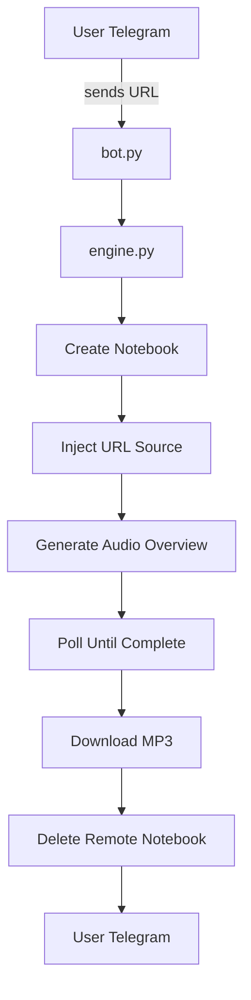

# NotebookLM Automation Analysis - Comprehensive Guide

## Overview
Deep analysis of NotebookLM automation through Telegram bot integration, including technical implementation patterns, authentication flows, and automation strategies for AI-powered content processing.

## 🔍 Repository Analysis

### notebookllm-automater (ankkitraj4/notebookllm-automater)
**NotebookLM Telegram Audio Bot**

#### Purpose
- **Primary Function**: Automates conversion of web links and YouTube videos into NotebookLM Audio Overviews (podcasts)
- **Technology**: Python + Telegram Bot + NotebookLM API + Playwright
- **Use Case**: Content-to-audio conversion via Telegram interface

#### Key Features
```yaml
Core Functionality:
  - URL processing (web links + YouTube videos)
  - NotebookLM Audio Overview generation
  - MP3 file delivery via Telegram
  - Automated pipeline with cleanup

Technical Stack:
  - Python 3.x
  - python-telegram-bot (async)
  - notebooklm-py (NotebookLM API wrapper)
  - Playwright (browser automation)
  - Google authentication via browser
```

#### Architecture Flow


#### File Structure
```yaml
Core Files:
  bot.py: Telegram bot interface, commands, URL handling, delivery
  engine.py: NotebookLM pipeline (create, ingest, generate, download, cleanup)
  auth_helper.py: One-time Google login via browser
  .env: Secrets configuration
  requirements.txt: Python dependencies

Configuration:
  TELEGRAM_BOT_TOKEN: Bot token from @BotFather
  ADMIN_CHAT_ID: Admin alerts for session expiry
  NOTEBOOKLM_HOME: Config directory (~/.notebooklm)
  AUDIO_TIMEOUT: Max wait time (600 seconds)
  AUDIO_POLL_INTERVAL: Status check interval (8 seconds)
  LOG_LEVEL: Python logging level
```

## 🔧 Technical Implementation Analysis

### 1. Authentication System

#### Google Login Flow
```python
# Pattern from auth_helper.py
class GoogleAuthenticator:
    def __init__(self, storage_path="~/.notebooklm/storage_state.json"):
        self.storage_path = storage_path
        self.browser = None
    
    async def authenticate(self):
        # One-time browser-based authentication
        self.browser = await playwright.chromium.launch(headless=False)
        page = await self.browser.new_page()
        
        # Navigate to Google login
        await page.goto("https://notebooklm.google.com")
        
        # Wait for user to complete login
        await page.wait_for_selector("[data-authenticated='true']")
        
        # Save session state for future headless use
        await self.browser.context.storage_state(path=self.storage_path)
        await self.browser.close()
    
    def load_session_state(self):
        # Load saved session for headless API calls
        return self.storage_path
```

#### Session Management
```python
# Session expiry handling
class SessionManager:
    def __init__(self, storage_path):
        self.storage_path = storage_path
        self.session_expiry = None
    
    async def check_session_validity(self):
        # Check if session is still valid
        try:
            # Attempt API call to validate session
            response = await self.make_api_call("GET", "/status")
            return response.status_code == 200
        except Exception as e:
            if "401" in str(e) or "403" in str(e):
                await self.alert_admin_session_expired()
                return False
            return True
    
    async def alert_admin_session_expired(self):
        # Notify admin via Telegram
        if ADMIN_CHAT_ID:
            await bot.send_message(
                chat_id=ADMIN_CHAT_ID,
                text="🚨 NotebookLM session expired! Please run auth_helper.py"
            )
```

### 2. NotebookLM Pipeline

#### Audio Overview Generation
```python
# Pattern from engine.py
class NotebookLMPipeline:
    def __init__(self, session_state):
        self.session_state = session_state
        self.notebooklm_client = None
    
    async def generate_audio_overview(self, url):
        # Step 1: Create notebook
        notebook = await self.create_notebook()
        notebook_id = notebook['id']
        
        try:
            # Step 2: Inject URL source
            await self.add_url_source(notebook_id, url)
            
            # Step 3: Generate Audio Overview
            generation_task = await self.start_audio_generation(notebook_id)
            task_id = generation_task['task_id']
            
            # Step 4: Poll until complete
            audio_url = await self.poll_audio_completion(notebook_id, task_id)
            
            # Step 5: Download MP3
            mp3_data = await self.download_audio(audio_url)
            
            return mp3_data
            
        finally:
            # Step 6: Cleanup - Delete remote notebook
            await self.delete_notebook(notebook_id)
    
    async def create_notebook(self):
        response = await self.notebooklm_client.post("/notebooks", json={
            "title": f"Audio Overview - {datetime.now().isoformat()}"
        })
        return response.json()
    
    async def add_url_source(self, notebook_id, url):
        await self.notebooklm_client.post(f"/notebooks/{notebook_id}/sources", json={
            "type": "url",
            "content": url
        })
    
    async def start_audio_generation(self, notebook_id):
        response = await self.notebooklm_client.post(f"/notebooks/{notebook_id}/audio", json={
            "type": "overview"
        })
        return response.json()
    
    async def poll_audio_completion(self, notebook_id, task_id, timeout=600):
        start_time = time.time()
        
        while time.time() - start_time < timeout:
            response = await self.notebooklm_client.get(
                f"/notebooks/{notebook_id}/audio/{task_id}"
            )
            
            status = response.json()['status']
            if status == 'completed':
                return response.json()['audio_url']
            elif status == 'failed':
                raise Exception("Audio generation failed")
            
            await asyncio.sleep(AUDIO_POLL_INTERVAL)
        
        raise TimeoutError("Audio generation timeout")
```

### 3. Telegram Bot Integration

#### URL Processing Handler
```python
# Pattern from bot.py
class NotebookLMBot:
    def __init__(self, token, pipeline):
        self.application = Application.builder().token(token).build()
        self.pipeline = pipeline
        self.active_generations = {}  # Rate limiting per user
    
    async def handle_url(self, update: Update, context: ContextTypes.DEFAULT_TYPE):
        user_id = update.effective_user.id
        url = update.message.text
        
        # Rate limiting check
        if user_id in self.active_generations:
            await update.message.reply_text(
                "🔄 You already have a podcast being generated. "
                "Please wait for it to complete."
            )
            return
        
        # Validate URL
        if not self.is_valid_url(url):
            await update.message.reply_text(
                "🔗 I only understand web links and YouTube URLs. "
                "Please send a valid URL."
            )
            return
        
        # Start generation
        await update.message.reply_text(
            "🎙️ Processing your URL... This usually takes 3-7 minutes."
        )
        
        self.active_generations[user_id] = True
        
        try:
            # Generate audio overview
            mp3_data = await self.pipeline.generate_audio_overview(url)
            
            # Check file size (Telegram limit: 50MB)
            if len(mp3_data) > 50 * 1024 * 1024:
                await update.message.reply_text(
                    "⚠️ Audio file is too large for Telegram (>50MB). "
                    "Try a shorter source."
                )
                return
            
            # Send audio file
            await update.message.reply_audio(
                audio=io.BytesIO(mp3_data),
                title=f"Audio Overview - {self.extract_domain(url)}",
                caption=f"🎧 Generated from: {url}"
            )
            
        except Exception as e:
            await update.message.reply_text(
                f"❌ Error: {str(e)}. Please try again later."
            )
        
        finally:
            # Clean up rate limiting
            if user_id in self.active_generations:
                del self.active_generations[user_id]
    
    def is_valid_url(self, text):
        url_pattern = r'https?://(?:[-\w.])+(?:[:\d]+)?(?:/(?:[\w/_.])*(?:\?(?:[\w&=%.])*)?(?:#(?:\w*))?)'
        return re.match(url_pattern, text) is not None
    
    def extract_domain(self, url):
        from urllib.parse import urlparse
        return urlparse(url).netloc
```

#### Command Handlers
```python
# Bot commands implementation
class CommandHandlers:
    async def start_command(self, update: Update, context: ContextTypes.DEFAULT_TYPE):
        await update.message.reply_text(
            "🎙️ **NotebookLM Audio Bot**\n\n"
            "Send me any web URL or YouTube link, "
            "and I'll generate an Audio Overview (podcast) for you!\n\n"
            "⏱️ Usually takes 3-7 minutes\n"
            "📁 Delivers as MP3 file\n"
            "🔗 Supports: Web pages, articles, YouTube videos"
        )
    
    async def help_command(self, update: Update, context: ContextTypes.DEFAULT_TYPE):
        help_text = """
        🎯 **How to Use:**
        1. Send any web URL or YouTube link
        2. Wait 3-7 minutes for processing
        3. Receive MP3 audio overview
        
        📝 **Supported Sources:**
        • Wikipedia articles
        • News websites
        • Blog posts
        • YouTube videos (transcript extracted)
        
        ⚠️ **Limitations:**
        • One generation at a time per user
        • Max 50MB file size
        • Session expires after days/weeks
        
        🛠️ **Admin Commands:**
        /status - Check bot and session health
        """
        await update.message.reply_text(help_text)
    
    async def status_command(self, update: Update, context: ContextTypes.DEFAULT_TYPE):
        # Check bot health
        bot_status = "✅ Bot is running"
        
        # Check NotebookLM session
        try:
            session_valid = await self.pipeline.check_session_validity()
            session_status = "✅ NotebookLM session valid" if session_valid else "❌ Session expired"
        except Exception as e:
            session_status = f"❌ Session error: {str(e)}"
        
        # Check active generations
        active_count = len(self.active_generations)
        
        status_text = f"""
        📊 **System Status:**
        
        🤖 Bot: {bot_status}
        🔐 Session: {session_status}
        🔄 Active Generations: {active_count}
        
        🕐 Last Check: {datetime.now().strftime('%H:%M:%S')}
        """
        
        await update.message.reply_text(status_text)
```

## 🚀 Implementation Strategies

### 1. Error Handling & Resilience

#### Comprehensive Error Management
```python
class ErrorHandlingStrategy:
    def __init__(self):
        self.retry_config = {
            'max_retries': 3,
            'backoff_factor': 2,
            'timeout_exceptions': [TimeoutError, asyncio.TimeoutError]
        }
    
    async def with_retry(self, func, *args, **kwargs):
        last_exception = None
        
        for attempt in range(self.retry_config['max_retries']):
            try:
                return await func(*args, **kwargs)
            except Exception as e:
                last_exception = e
                
                # Don't retry on certain errors
                if type(e) in self.retry_config['timeout_exceptions']:
                    raise e
                
                # Exponential backoff
                if attempt < self.retry_config['max_retries'] - 1:
                    delay = self.retry_config['backoff_factor'] ** attempt
                    await asyncio.sleep(delay)
        
        raise last_exception
    
    async def handle_session_expiry(self, user_id, error):
        if "401" in str(error) or "403" in str(error):
            # Notify user
            await self.bot.send_message(
                chat_id=user_id,
                text="🔐 Session expired. Please contact admin to re-authenticate."
            )
            
            # Alert admin
            if ADMIN_CHAT_ID:
                await self.bot.send_message(
                    chat_id=ADMIN_CHAT_ID,
                    text=f"🚨 Session expired for user {user_id}. Run auth_helper.py"
                )
```

#### File Size Management
```python
class FileSizeManager:
    TELEGRAM_LIMIT = 50 * 1024 * 1024  # 50MB
    
    @staticmethod
    def check_file_size(file_data):
        return len(file_data) <= FileSizeManager.TELEGRAM_LIMIT
    
    @staticmethod
    async def compress_audio_if_needed(audio_data):
        if len(audio_data) > FileSizeManager.TELEGRAM_LIMIT:
            # Implement audio compression
            compressed_data = await FileSizeManager.compress_mp3(audio_data)
            return compressed_data
        return audio_data
    
    @staticmethod
    async def compress_mp3(audio_data):
        # Use ffmpeg or similar to compress audio
        # This is a placeholder for actual implementation
        pass
```

### 2. Performance Optimization

#### Concurrent Processing
```python
class ConcurrentProcessor:
    def __init__(self, max_concurrent=3):
        self.semaphore = asyncio.Semaphore(max_concurrent)
        self.active_tasks = {}
    
    async def process_url_concurrent(self, user_id, url):
        async with self.semaphore:
            self.active_tasks[user_id] = asyncio.current_task()
            
            try:
                result = await self.pipeline.generate_audio_overview(url)
                return result
            finally:
                if user_id in self.active_tasks:
                    del self.active_tasks[user_id]
    
    def get_active_tasks_count(self):
        return len(self.active_tasks)
    
    async def cancel_user_task(self, user_id):
        if user_id in self.active_tasks:
            task = self.active_tasks[user_id]
            task.cancel()
            del self.active_tasks[user_id]
            return True
        return False
```

#### Caching Strategy
```python
class AudioCache:
    def __init__(self, redis_client=None):
        self.redis = redis_client
        self.local_cache = {}
        self.cache_ttl = 3600  # 1 hour
    
    def get_cache_key(self, url):
        # Generate cache key from URL
        import hashlib
        return f"audio:{hashlib.md5(url.encode()).hexdigest()}"
    
    async def get_cached_audio(self, url):
        cache_key = self.get_cache_key(url)
        
        # Check local cache first
        if cache_key in self.local_cache:
            return self.local_cache[cache_key]
        
        # Check Redis cache
        if self.redis:
            cached_data = await self.redis.get(cache_key)
            if cached_data:
                self.local_cache[cache_key] = cached_data
                return cached_data
        
        return None
    
    async def cache_audio(self, url, audio_data):
        cache_key = self.get_cache_key(url)
        
        # Store in local cache
        self.local_cache[cache_key] = audio_data
        
        # Store in Redis cache
        if self.redis:
            await self.redis.setex(cache_key, self.cache_ttl, audio_data)
```

### 3. Security & Privacy

#### Data Protection
```python
class DataProtection:
    def __init__(self):
        self.user_consent = {}
        self.data_retention_days = 30
    
    async def check_user_consent(self, user_id):
        return self.user_consent.get(user_id, False)
    
    async def record_consent(self, user_id, consent_given):
        self.user_consent[user_id] = consent_given
    
    async def cleanup_old_data(self):
        # Clean up data older than retention period
        cutoff_date = datetime.now() - timedelta(days=self.data_retention_days)
        # Implementation for data cleanup
        pass
    
    def anonymize_logs(self, log_entry):
        # Remove or hash sensitive information
        import re
        
        # Remove URLs
        log_entry = re.sub(r'https?://[^\s]+', '[URL]', log_entry)
        
        # Remove user IDs
        log_entry = re.sub(r'user_id:\s*\d+', 'user_id:[REDACTED]', log_entry)
        
        return log_entry
```

#### Access Control
```python
class AccessControl:
    def __init__(self):
        self.user_limits = {}
        self.admin_users = set()
    
    def add_admin(self, user_id):
        self.admin_users.add(user_id)
    
    def is_admin(self, user_id):
        return user_id in self.admin_users
    
    async def check_user_limit(self, user_id, limit_per_hour=5):
        current_hour = datetime.now().hour
        key = f"{user_id}:{current_hour}"
        
        current_count = self.user_limits.get(key, 0)
        if current_count >= limit_per_hour:
            return False
        
        self.user_limits[key] = current_count + 1
        return True
    
    async def reset_hourly_limits(self):
        # Reset counters for new hour
        current_hour = datetime.now().hour
        keys_to_remove = []
        
        for key in self.user_limits:
            _, hour = key.split(':')
            if int(hour) != current_hour:
                keys_to_remove.append(key)
        
        for key in keys_to_remove:
            del self.user_limits[key]
```

## 📊 Monitoring & Analytics

### 1. Performance Metrics
```python
class MetricsCollector:
    def __init__(self):
        self.metrics = {
            'total_requests': 0,
            'successful_generations': 0,
            'failed_generations': 0,
            'average_generation_time': 0,
            'active_users': set(),
            'popular_sources': {}
        }
    
    def record_request(self, user_id, url):
        self.metrics['total_requests'] += 1
        self.metrics['active_users'].add(user_id)
        
        # Track popular sources
        domain = self.extract_domain(url)
        self.metrics['popular_sources'][domain] = \
            self.metrics['popular_sources'].get(domain, 0) + 1
    
    def record_success(self, generation_time):
        self.metrics['successful_generations'] += 1
        
        # Update average generation time
        total_time = self.metrics['average_generation_time'] * \
                    (self.metrics['successful_generations'] - 1)
        total_time += generation_time
        self.metrics['average_generation_time'] = \
            total_time / self.metrics['successful_generations']
    
    def record_failure(self):
        self.metrics['failed_generations'] += 1
    
    def get_success_rate(self):
        total = self.metrics['successful_generations'] + self.metrics['failed_generations']
        if total == 0:
            return 0
        return self.metrics['successful_generations'] / total
```

### 2. Health Monitoring
```python
class HealthMonitor:
    def __init__(self, bot, pipeline):
        self.bot = bot
        self.pipeline = pipeline
        self.last_health_check = None
    
    async def check_system_health(self):
        health_status = {
            'bot_status': 'healthy',
            'notebooklm_status': 'healthy',
            'active_generations': 0,
            'timestamp': datetime.now().isoformat()
        }
        
        # Check bot status
        try:
            await self.bot.get_me()
        except Exception as e:
            health_status['bot_status'] = f'unhealthy: {str(e)}'
        
        # Check NotebookLM session
        try:
            session_valid = await self.pipeline.check_session_validity()
            health_status['notebooklm_status'] = 'healthy' if session_valid else 'session_expired'
        except Exception as e:
            health_status['notebooklm_status'] = f'unhealthy: {str(e)}'
        
        # Check active generations
        health_status['active_generations'] = len(self.bot.active_generations)
        
        self.last_health_check = health_status
        return health_status
    
    async def send_health_alerts(self, health_status):
        alerts = []
        
        if health_status['bot_status'] != 'healthy':
            alerts.append(f"🤖 Bot issue: {health_status['bot_status']}")
        
        if health_status['notebooklm_status'] == 'session_expired':
            alerts.append("🔐 NotebookLM session expired!")
        
        if health_status['notebooklm_status'] != 'healthy':
            alerts.append(f"📝 NotebookLM issue: {health_status['notebooklm_status']}")
        
        if alerts and ADMIN_CHAT_ID:
            alert_message = "\n".join(alerts)
            await self.bot.send_message(
                chat_id=ADMIN_CHAT_ID,
                text=f"🚨 Health Alert:\n{alert_message}"
            )
```

## 🎯 Business Applications

### 1. Content Processing Service
```python
class ContentProcessingService:
    def __init__(self, bot, pipeline):
        self.bot = bot
        self.pipeline = pipeline
        self.processing_queue = asyncio.Queue()
        self.results_cache = {}
    
    async def queue_processing(self, user_id, url, priority='normal'):
        await self.processing_queue.put({
            'user_id': user_id,
            'url': url,
            'priority': priority,
            'timestamp': datetime.now()
        })
    
    async def process_queue(self):
        while True:
            try:
                task = await self.processing_queue.get()
                
                # Process based on priority
                if task['priority'] == 'high':
                    await self.process_high_priority(task)
                else:
                    await self.process_normal_priority(task)
                
            except Exception as e:
                print(f"Queue processing error: {e}")
    
    async def process_high_priority(self, task):
        # Process immediately for high priority
        result = await self.pipeline.generate_audio_overview(task['url'])
        await self.deliver_result(task['user_id'], result)
    
    async def process_normal_priority(self, task):
        # Process with normal priority and rate limiting
        await self.pipeline.generate_audio_overview(task['url'])
        await self.deliver_result(task['user_id'], result)
```

### 2. Multi-Platform Integration
```python
class MultiPlatformIntegration:
    def __init__(self):
        self.platforms = {
            'telegram': TelegramIntegration(),
            'discord': DiscordIntegration(),
            'slack': SlackIntegration(),
            'web': WebIntegration()
        }
    
    async def process_request(self, platform, user_id, url):
        if platform not in self.platforms:
            raise ValueError(f"Unsupported platform: {platform}")
        
        platform_handler = self.platforms[platform]
        
        # Validate user permissions
        if not await platform_handler.check_user_permission(user_id):
            raise PermissionError("User not authorized")
        
        # Process through unified pipeline
        result = await self.generate_audio_overview(url)
        
        # Deliver on specific platform
        await platform_handler.deliver_result(user_id, result)
    
    async def generate_audio_overview(self, url):
        # Shared processing logic
        pipeline = NotebookLMPipeline()
        return await pipeline.generate_audio_overview(url)
```

## 🎉 Implementation Roadmap

### Phase 1: Core Implementation (Week 1-2)
- [ ] Set up basic Telegram bot with URL handling
- [ ] Implement NotebookLM authentication
- [ ] Create audio generation pipeline
- [ ] Add basic error handling

### Phase 2: Enhanced Features (Week 3-4)
- [ ] Implement rate limiting and user management
- [ ] Add comprehensive error handling
- [ ] Create admin commands and monitoring
- [ ] Implement file size management

### Phase 3: Performance & Scaling (Week 5-6)
- [ ] Add concurrent processing capabilities
- [ ] Implement caching system
- [ ] Create monitoring and analytics
- [ ] Add health monitoring

### Phase 4: Advanced Features (Week 7-8)
- [ ] Multi-platform integration
- [ ] Advanced security features
- [ ] Business logic and monetization
- [ ] Production deployment

---

## 📚 Key Insights

### Technical Patterns
1. **Browser-based Authentication**: One-time Google login with session persistence
2. **Pipeline Architecture**: Sequential processing with cleanup
3. **Rate Limiting**: Per-user concurrent request management
4. **Error Handling**: Comprehensive failure detection and recovery

### Integration Opportunities
1. **Multi-Platform Support**: Extend beyond Telegram to Discord, Slack
2. **Content Types**: Support documents, PDFs, images in addition to URLs
3. **Processing Options**: Different audio formats, lengths, styles
4. **Business Models**: Subscription, pay-per-use, enterprise features

### Security Considerations
1. **Session Management**: Handle Google authentication expiry gracefully
2. **Data Privacy**: Implement user consent and data retention policies
3. **Access Control**: Rate limiting and user permission management
4. **Monitoring**: Health checks and alerting system

---

**Research Date**: 2026-05-06  
**Status**: ✅ Complete  
**Key Finding**: Well-structured NotebookLM automation with comprehensive error handling  
**Recommendation**: Excellent reference for AI service automation patterns
